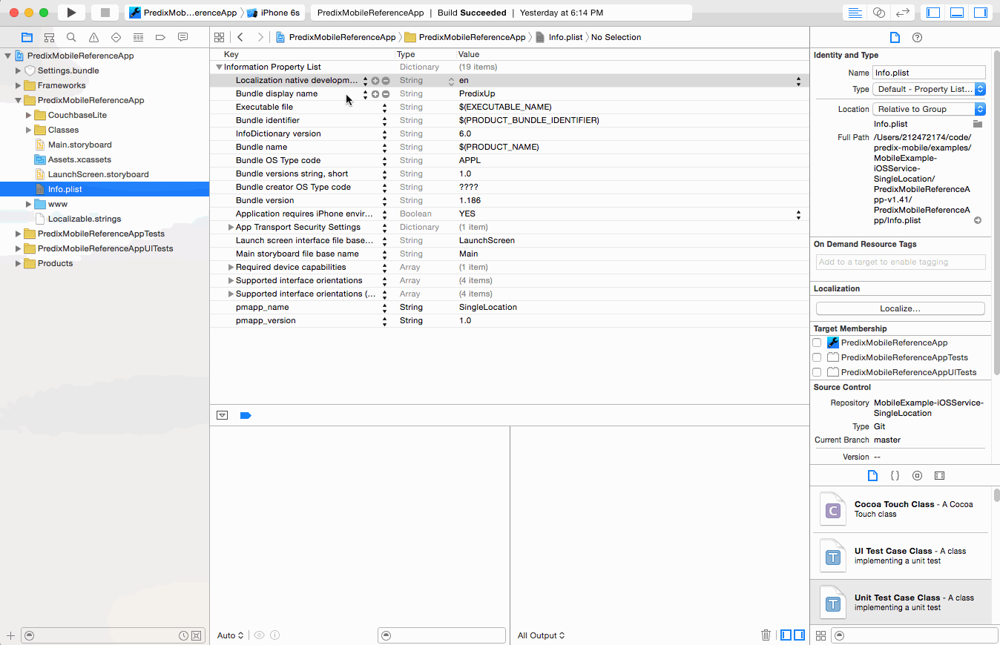

#Predix Mobile iOS Service: Location#

This repo contains a Predix Mobile iOS service example, demonstrating how to implement a location service that can retrieve your current location coordinates and get the placemark (address) info given a set of coordinates.  The purpose of this repo is to provide an example of how to implement a service, but it is also fully functional as a location service to use in your Predix Mobile application.

##Step 0 - Prerequisites##
It is assumed you already have a Predix Mobile cloud services installation, have installed the Predix Mobile command line tool, and have installed a Predix Mobile iOS Container, following the Getting Started examples for those repos.

It is also assumed you have a basic knowledge of mobile iOS development using XCode and Swift.

##Step 1 - Integrate the code

1. Add the files from this repo
  
  A) Open your Predix Mobile container app project. In the Project Manager in left-hand pane, expand the PredixMobileReferenceApp project, then expand the PredixMobileReferenceApp group. Within that group, expand the Classes group. In this group, create a group called "LocationService".
  
  B) Add the files the `LocationService.swift`, `LocationUtility.swift`, and `AddressUtility.swift` to this group, either by dragging from Finder, or by using **File -> Add File to "project"**. When using the add file dialog, ensure the files are copied to your project, and added to your PredixMobileReferenceApp target.
  
  C) Likewise, add a "LocationService" group to your PredixMobileReferenceAppTests group. Add the LocationServiceTests.swift file to this group, ensuring that you copy the file, and add it to the PredixMobileReferenceAppTests unit testing target.

2. Set the location authorization prompt in your `info.plist` file

  For iOS, apps are required to ask for the user's permission to use location services.  iOS apps do this via a pop up modal. The developer must set the message to be shown to the user in this modal. If this message isn't set the pop-up modal asking for permission to use the user's location won't appear, and defaults to an unautorized state, barring the app from getting location information.
  
  To set the message for the modal for this service, you need to add and/or update the key `NSLocationWhenInUseUsageDescription`, with a message describing to the user why you are requesting their location, in your `info.plist`.
  
  .
  
3. Comment out the testing code in AppDelegate.swift

  In the iOS Predix Mobile Container app, there is a section of code used to quit the simulator while running unit tests.  For this example however, we want the simulator to run so that the prompt to ask the user for their location appears, allowing you to Allow or Deny location services.
  
  Open the AppDelegate.swift file and comment out the following lines: 
  
  ```
  if NSProcessInfo.processInfo().environment["XCInjectBundle"] != nil {
      // Exit if we're running unit tests...
      PGSDKLogger.debug("Detected running functional unit tests, not starting normal services or running normal UI processes")
      return true
  }
  ```

##Step 2 - Register your new service##

To register a client service in Predix Mobile we need to specify it in our `AppDelegate.swift` file.

In the `AppDelegate.swift` file, navigate to the application: `didFinishLaunchingWithOptions:` method. In this method, you will see a line that looks like this:

```
PredixMobilityConfiguration.loadConfiguration()
```

Directly after that line, add the following:

```
PredixMobilityConfiguration.additionalBootServicesToRegister = [LocationService.self]
```

This will inform the iOS Predix Mobile SDK framework to load your new service when the app starts, thus making it available to your webapp.

##Step 3 - Run the unit tests##

  To ensure the code is working, run the unit tests.

##Step 4 - Call the service from a webapp

Your new iOS client service is exposed through the service identifier "location".

The endpoints available are:

1. `http://pmapi/location/single` which returns a latitude and longitude.
2. `http://pmapi/location/address?latitude=0.0&longitude=0.0` which retrieves address (a.k.a. Apple's placemark) properties for the given coordinates

A simple demo webapp is provided in the demo-webapp directory in the git repo.


##Troubleshooting##

**Test are timing out**
If your tests are timing out, you are probably not receiving a location from the simulator, to rectify that, see the troubleshooting section **Not Receiving Location in Simulator**.

**Not Receiving Location in Simulator**
If you are using the iPhone simulator, and are not receiving a location, in the simulator menu bar, go to **Debug -> Location** and set the location to Apple or a Custom Location.
